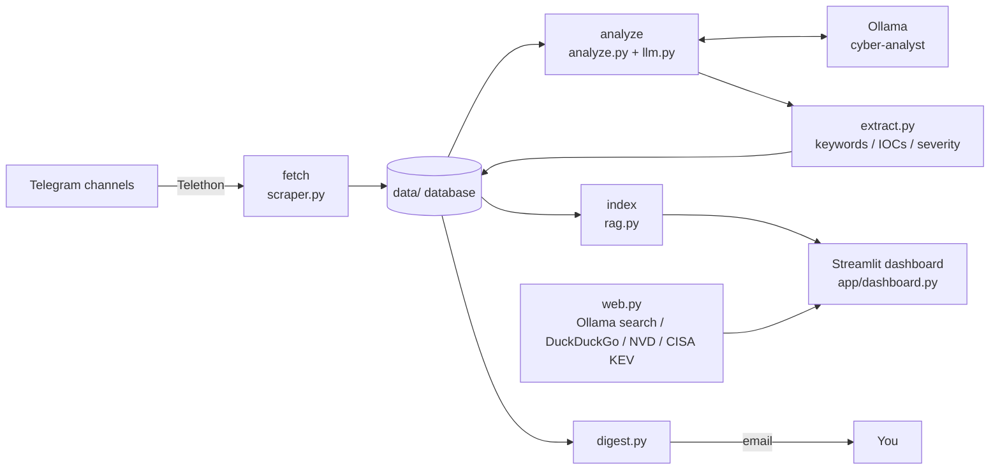

<div align="center">
🛡️ Cyber Intel Board
Turn noisy Telegram cybersecurity channels into a labelled, searchable, local-first threat-intelligence dashboard.


-000000)
-26A5E4?logo=telegram&logoColor=white)

Features · How it works · Quick start · Commands · Configuration · Project structure · Security · Roadmap
</div>
---
✨ Overview
Security news is scattered across many Telegram channels, arrives in bulk, and has no structure. Cyber Intel Board automates the boring part:
Collects new posts from the channels you choose.
Labels them (category + severity) with a local AI model running in Ollama — no cloud LLM required.
Extracts keywords and IOCs with deterministic rules (no AI involved).
Shows everything in a Streamlit dashboard, with a chat that answers questions about your archive and can optionally search the internet.
Alerts you by email when new critical/high-severity posts appear.
🚀 Features
	Feature	Where
📥	Fetch new posts from Telegram channels	`intel/jobs/scraper.py`
🏷️	AI labelling and keyword extraction using a local model	`intel/jobs/analyze.py`, `intel/llm.py`
🔎	Rule-based keyword / IOC extraction and severity rules (no AI)	`intel/extract.py`
🗂️	Fixed categories, severities and colours	`intel/taxonomy.py`
📊	Interactive dashboard	`app/dashboard.py`
💬	"Ask the archive" chat with streaming answers (RAG)	`intel/rag.py`
🌐	Optional internet in chat: Ollama web search (DuckDuckGo fallback), NVD, CISA KEV	`intel/web.py`
📧	Email digest of new critical/high posts	`intel/jobs/digest.py`
🔁	Scheduled loop (`--loop N` minutes)	`intel/jobs/pipeline.py`
🧠	Custom Ollama model `cyber-analyst` and fine-tuning data export	`models/Modelfile`, `intel/jobs/export_training.py`
🖥️	Desktop shortcuts (Windows)	`scripts/`
🧭 How it works

The pipeline order is fetch → analyze → index (→ digest). Every step can also be run on its own.
⚡ Quick start
Prerequisites
Windows with Python 3.12
Ollama installed and running
A Telegram account and API credentials from https://my.telegram.org
Setup
```powershell
py -3.12 -m venv venv
venv\Scripts\activate
pip install -r requirements.txt

copy .env.example .env          # then fill in .env (see Configuration)

ollama pull qwen3.5:2b
ollama pull nomic-embed-text

python run.py model             # builds the custom model "cyber-analyst"
python run.py login             # only if you have no data\session.session
python run.py channels          # prints exact channel usernames for CHANNELS=
```
Then set `OLLAMA_MODEL=cyber-analyst` in `.env`.
Run
```powershell
python run.py pipeline          # fetch + analyze + index once
python run.py dashboard         # open the dashboard
```
> Coming from an older flat folder layout? Copy your old `cyber.db` and `session.session` into the project folder (or `data/`); they are moved into `data/` automatically.
🧰 Commands
Everything goes through one entry point: `python run.py <command>`.
Command	What it does
`dashboard`	Open the web dashboard
`pipeline`	Fetch + analyze + index once
`pipeline --loop 60`	Repeat every 60 minutes
`pipeline --digest`	Also email new critical/high alerts
`fetch`	Fetch new Telegram posts only
`analyze`	Run AI labelling + keyword extraction only
`index`	Build the chat search index only
`digest`	Email new critical/high posts
`login`	One-time Telegram login (creates `data/session.session`)
`channels`	List your channels with exact usernames
`export`	Write `data/train.jsonl` for fine-tuning
`model [name]`	Build the custom Ollama model from `models/Modelfile` (default `cyber-analyst`)
Desktop shortcut (Windows)
```powershell
powershell -ExecutionPolicy Bypass -File scripts\create_shortcut.ps1
```
Creates Cyber Intel Board (starts Ollama, fetches, analyzes, opens the dashboard) and a view-only version that skips the fetch.
🌐 Internet for the chat
Turn on the 🌐 switch in the chat view.
Optional: set `OLLAMA_API_KEY` in `.env` (free key at https://ollama.com/settings/keys) to use Ollama web search.
Without a key, a DuckDuckGo fallback is used.
CVE questions also check NVD and CISA's Known Exploited Vulnerabilities (KEV) list.
⚙️ Configuration
Copy `.env.example` to `.env` and fill in the values.
Variable	Purpose
`TG_API_ID`, `TG_API_HASH`, `TG_PHONE`	Telegram API credentials and login phone
`CHANNELS`	Comma-separated channel usernames, no `@` (example in template: `BugCrowd,`)
`OLLAMA_MODEL`	Model used for analysis and chat (README recommends `cyber-analyst`)
`FETCH_LIMIT`	Max posts fetched per channel per run (template default: `100`)
`GMAIL_USER`, `GMAIL_APP_PASSWORD`, `DIGEST_TO`	Email digest sender, app password and recipient
`OLLAMA_API_KEY`	Optional, enables Ollama web search
🗂️ Project structure
```
.
├── run.py                  # the ONE command: python run.py <command>
├── .env.example            # copy to .env and fill in
├── requirements.txt
├── app/
│   └── dashboard.py        # Streamlit dashboard
├── intel/
│   ├── config.py           # settings + every file path
│   ├── db.py               # database setup
│   ├── taxonomy.py         # fixed categories / severities / colours
│   ├── extract.py          # keyword + IOC extraction, severity rules (no AI)
│   ├── llm.py              # calls Ollama (thinking off = faster)
│   ├── rag.py              # "Ask the archive" search + streaming answers
│   ├── web.py              # Ollama web search, NVD, CISA KEV
│   └── jobs/
│       ├── scraper.py      # fetch new Telegram posts
│       ├── analyze.py      # AI labels + keywords
│       ├── pipeline.py     # fetch → analyze → index (→ digest), with --loop
│       ├── digest.py       # email new critical/high posts
│       ├── login.py        # one-time Telegram login
│       ├── channels.py     # list your channels + exact usernames
│       └── export_training.py
├── models/Modelfile        # custom Ollama model (cyber-analyst)
├── scripts/                # Windows launcher + desktop shortcut maker
├── data/                   # database, Telegram session, caches (git-ignored)
└── logs/                   # pipeline.log (git-ignored)
```
🧱 Tech stack
Technology	Role
Python 3.12	Language
Telethon	Telegram client
Ollama (`ollama` package)	Local LLM + embeddings
Streamlit	Dashboard UI
Plotly, pandas, numpy	Charts and data handling
python-dotenv	Loads `.env`
ddgs	DuckDuckGo search fallback
🔒 Security & privacy
Never commit or share `.env` or `data/session.session` — they grant access to your accounts. Both are kept out of git (`data/` is git-ignored).
Analysis and chat run on a local model; nothing is sent to a cloud LLM.
With the 🌐 switch on, your chat queries are sent to the search provider (Ollama web search or DuckDuckGo) and, for CVE questions, NVD/CISA.
Use a Gmail app password for `GMAIL_APP_PASSWORD`, never your main password.
Telegram posts are untrusted text that is passed to an LLM. Treat labels and summaries as decision support, not ground truth.
🗺️ Roadmap
Ideas, not yet implemented:
[ ] Automated tests (start with `intel/extract.py`)
[ ] Pinned dependency versions / lock file
[ ] Labelling-accuracy evaluation set
[ ] Dockerfile and cross-platform launch scripts
[ ] Dashboard authentication
[ ] Additional sources (RSS, advisories)
[ ] Actually fine-tune on the exported `data/train.jsonl`
🤝 Contributing
Issues and pull requests are welcome. Please keep secrets out of commits and run the pipeline once locally before opening a PR.
📄 License
No license file is currently included in the repository. Add one (for example MIT) before others reuse the code.
<!-- Suggested: add dashboard screenshots to docs/ and reference them here. -->