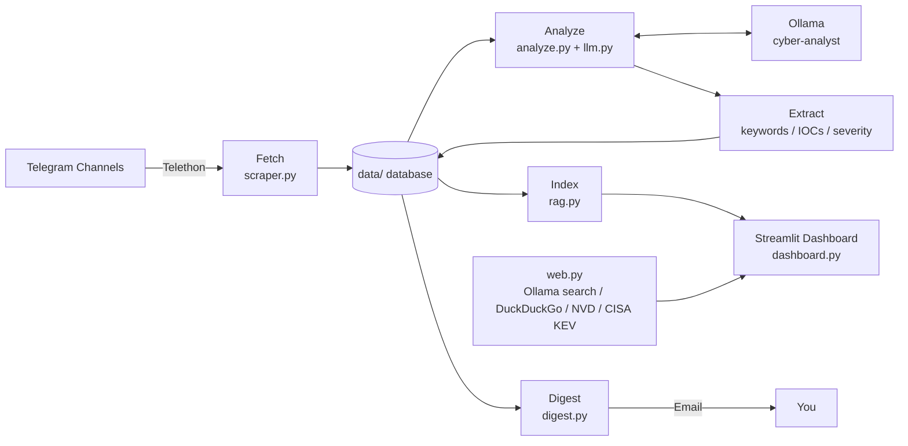

<div align="center">

# 🛡️ Cyber Intel Board

### Local-First Cybersecurity Threat Intelligence Dashboard

**Turn noisy Telegram cybersecurity channels into a labelled, searchable threat-intelligence workspace — powered by local AI.**

<p>
  
  
  
  
  
</p>

<p>
  <a href="#-overview">Overview</a> ·
  <a href="#-features">Features</a> ·
  <a href="#-architecture--workflow">Architecture</a> ·
  <a href="#-quick-start">Quick Start</a> ·
  <a href="#-commands">Commands</a> ·
  <a href="#-configuration">Configuration</a> ·
  <a href="#-project-structure">Project Structure</a> ·
  <a href="#-security--privacy">Security</a> ·
  <a href="#-roadmap">Roadmap</a>
</p>

</div>

---

## ✨ Overview

Security intelligence is scattered across Telegram channels, often arrives in bulk, and usually lacks consistent structure.

**Cyber Intel Board** automates the repetitive parts of that workflow:

1. **Collect** new posts from the Telegram channels you select.
2. **Label** posts with category and severity using a **local AI model** through Ollama.
3. **Extract** keywords and IOCs using deterministic, rule-based logic.
4. **Index and search** the archive through a Streamlit dashboard with an "Ask the archive" RAG chat.
5. **Optionally search the internet** from chat using Ollama web search, DuckDuckGo, NVD, and CISA KEV.
6. **Alert by email** when new critical/high-severity intelligence appears.

> **Local-first design:** analysis and archive chat use a local Ollama model, so no cloud LLM is required.

---

## 🎯 What the Project Solves

### The problem

Cybersecurity information from Telegram channels can be:

- high-volume and difficult to review manually,
- inconsistent in structure,
- difficult to search later,
- mixed with irrelevant or lower-priority information,
- time-consuming to monitor continuously.

### The approach

Cyber Intel Board creates a repeatable pipeline:

**Telegram → Fetch → AI Analysis → Rule-Based Extraction → Database → Search/RAG → Dashboard → Optional Email Alerts**

This turns unstructured channel posts into a local, searchable intelligence archive.

---

## 🚀 Features

|     | Feature                                                | Implementation                          |
| --- | ------------------------------------------------------ | --------------------------------------- |
| 📥  | Fetch new Telegram posts                               | `intel/jobs/scraper.py`                 |
| 🏷️  | AI labelling and keyword extraction                    | `intel/jobs/analyze.py`, `intel/llm.py` |
| 🔎  | Rule-based keyword / IOC extraction and severity rules | `intel/extract.py`                      |
| 🗂️  | Fixed categories, severities, and colours              | `intel/taxonomy.py`                     |
| 📊  | Interactive dashboard                                  | `app/dashboard.py`                      |
| 💬  | "Ask the archive" chat with streaming RAG answers      | `intel/rag.py`                          |
| 🌐  | Optional internet-assisted chat                        | `intel/web.py`                          |
| 📧  | Critical/high email digest                             | `intel/jobs/digest.py`                  |
| 🔁  | Scheduled pipeline loop                                | `intel/jobs/pipeline.py`                |
| 🧠  | Custom Ollama model: `cyber-analyst`                   | `models/Modelfile`                      |
| 📦  | Fine-tuning data export                                | `intel/jobs/export_training.py`         |
| 🖥️  | Windows desktop shortcuts                              | `scripts/`                              |

---

## 🧠 AI + Deterministic Intelligence

The project deliberately separates AI-generated analysis from deterministic extraction.

### Local AI

Ollama is used for:

- post labelling,
- category/severity analysis,
- archive chat,
- local embeddings for search.

The README recommends the custom model:

```text
cyber-analyst
```

### Deterministic extraction

`intel/extract.py` handles:

- keyword extraction,
- IOC extraction,
- severity rules.

These rules do **not** require an AI model.

This separation makes the pipeline easier to understand: the local LLM handles semantic analysis, while explicit rules handle structured extraction and severity logic.

---

## 🏗️ Architecture & Workflow

### End-to-end pipeline



### Pipeline order

**`fetch → analyze → index → digest (optional)`**

Each stage can also be executed independently.

### Typical execution flow

```text
1. Start the project
      ↓
2. Load .env configuration
      ↓
3. Connect to Telegram through Telethon
      ↓
4. Fetch new channel posts
      ↓
5. Store fetched data locally
      ↓
6. Analyze posts with Ollama
      ↓
7. Extract keywords / IOCs / severity using rules
      ↓
8. Store enriched intelligence
      ↓
9. Build / update the RAG search index
      ↓
10. Explore results in Streamlit
      ↓
11. Ask questions about the archive
      ↓
12. Optionally use internet sources in chat
      ↓
13. Optionally email critical/high alerts
```

---

## 🔧 Technology Stack

| Technology        | Role                                |
| ----------------- | ----------------------------------- |
| **Python 3.12**   | Core programming language           |
| **Telethon**      | Telegram client and post collection |
| **Ollama**        | Local LLM and embeddings            |
| **Streamlit**     | Interactive dashboard UI            |
| **Plotly**        | Data visualization                  |
| **pandas**        | Data handling                       |
| **numpy**         | Numerical/data operations           |
| **python-dotenv** | `.env` configuration loading        |
| **ddgs**          | DuckDuckGo web-search fallback      |

### External intelligence sources

When internet-assisted chat is enabled:

- Ollama web search
- DuckDuckGo fallback
- NVD for CVE-related information
- CISA Known Exploited Vulnerabilities (KEV)

---

## 📦 Prerequisites

Before running the project, have:

- Windows
- **Python 3.12**
- **Ollama** installed and running
- A Telegram account
- Telegram API credentials from `https://my.telegram.org`

---

## ⚡ Quick Start

### 1. Create a virtual environment

```powershell
py -3.12 -m venv venv
venv\Scripts\activate
```

### 2. Install dependencies

```powershell
pip install -r requirements.txt
```

### 3. Configure environment variables

```powershell
copy .env.example .env
```

Then fill in the required values described in the configuration section below.

### 4. Pull the recommended Ollama models

```powershell
ollama pull qwen3.5:2b
ollama pull nomic-embed-text
```

### 5. Build the custom Ollama model

```powershell
python run.py model
```

This builds the custom model:

```text
cyber-analyst
```

### 6. Log in to Telegram

Run this only when `data/session.session` does not already exist:

```powershell
python run.py login
```

### 7. Check channel usernames

```powershell
python run.py channels
```

This prints the exact channel usernames to use in `CHANNELS`.

### 8. Select the model

Set:

```env
OLLAMA_MODEL=cyber-analyst
```

### 9. Run the pipeline

```powershell
python run.py pipeline
```

This performs:

**fetch → analyze → index**

### 10. Open the dashboard

```powershell
python run.py dashboard
```

---

## 🛠️ Commands

All project operations use one entry point:

```powershell
python run.py <command>
```

| Command              | Description                                             |
| -------------------- | ------------------------------------------------------- |
| `dashboard`          | Open the Streamlit dashboard                            |
| `pipeline`           | Fetch + analyze + index once                            |
| `pipeline --loop 60` | Repeat the pipeline every 60 minutes                    |
| `pipeline --digest`  | Also email new critical/high alerts                     |
| `fetch`              | Fetch new Telegram posts only                           |
| `analyze`            | Run AI labelling + extraction only                      |
| `index`              | Build the chat search index only                        |
| `digest`             | Email new critical/high posts                           |
| `login`              | One-time Telegram login; creates `data/session.session` |
| `channels`           | List channels with exact usernames                      |
| `export`             | Write `data/train.jsonl` for fine-tuning                |
| `model [name]`       | Build the custom Ollama model from `models/Modelfile`   |

### Scheduled operation

Run the full workflow every 60 minutes:

```powershell
python run.py pipeline --loop 60
```

Include email alerts:

```powershell
python run.py pipeline --digest
```

---

## 🖥️ Windows Desktop Shortcut

Create desktop launchers with:

```powershell
powershell -ExecutionPolicy Bypass -File scripts\create_shortcut.ps1
```

The shortcut setup provides:

### Full launcher

Starts Ollama, fetches, analyzes, and opens the dashboard.

### View-only launcher

Opens the dashboard while skipping the fetch stage.

---

## 🌐 Internet-Assisted Chat

The dashboard chat can optionally use the internet.

Turn on the **🌐 switch** in the chat view.

### Ollama web search

Set an optional API key:

```env
OLLAMA_API_KEY=...
```

### Search fallback

Without an Ollama key, the application uses a DuckDuckGo fallback.

### Vulnerability intelligence

CVE-related questions also check:

- **NVD**
- **CISA Known Exploited Vulnerabilities (KEV)**

---

## ⚙️ Configuration

Copy the example environment file:

```powershell
copy .env.example .env
```

Then configure the following values:

| Variable             | Purpose                                                              |
| -------------------- | -------------------------------------------------------------------- |
| `TG_API_ID`          | Telegram API ID                                                      |
| `TG_API_HASH`        | Telegram API hash                                                    |
| `TG_PHONE`           | Telegram login phone                                                 |
| `CHANNELS`           | Comma-separated channel usernames; do not include `@`                |
| `OLLAMA_MODEL`       | Ollama model used for analysis and chat                              |
| `FETCH_LIMIT`        | Maximum posts fetched per channel per run; template default is `100` |
| `GMAIL_USER`         | Gmail account used for digest sending                                |
| `GMAIL_APP_PASSWORD` | Gmail app password                                                   |
| `DIGEST_TO`          | Digest recipient                                                     |
| `OLLAMA_API_KEY`     | Optional key enabling Ollama web search                              |

Example channel configuration:

```env
CHANNELS=BugCrowd,
```

---

## 🗂️ Project Structure

```text
.
├── run.py
├── .env.example
├── requirements.txt
│
├── app/
│   └── dashboard.py
│
├── intel/
│   ├── config.py
│   ├── db.py
│   ├── taxonomy.py
│   ├── extract.py
│   ├── llm.py
│   ├── rag.py
│   ├── web.py
│   │
│   └── jobs/
│       ├── scraper.py
│       ├── analyze.py
│       ├── pipeline.py
│       ├── digest.py
│       ├── login.py
│       ├── channels.py
│       └── export_training.py
│
├── models/
│   └── Modelfile
│
├── scripts/
│
├── data/
│   ├── database
│   ├── Telegram session
│   └── caches
│
└── logs/
    └── pipeline.log
```

### Core modules

| Path                            | Responsibility                                 |
| ------------------------------- | ---------------------------------------------- |
| `run.py`                        | Single command entry point for the project     |
| `app/dashboard.py`              | Streamlit dashboard                            |
| `intel/config.py`               | Settings and file paths                        |
| `intel/db.py`                   | Database setup                                 |
| `intel/taxonomy.py`             | Categories, severities, and colours            |
| `intel/extract.py`              | Keyword, IOC, and severity-rule extraction     |
| `intel/llm.py`                  | Ollama calls                                   |
| `intel/rag.py`                  | Archive search and streaming answers           |
| `intel/web.py`                  | Web search, NVD, and CISA KEV integration      |
| `intel/jobs/scraper.py`         | Telegram post collection                       |
| `intel/jobs/analyze.py`         | AI analysis and labelling                      |
| `intel/jobs/pipeline.py`        | Fetch → analyze → index orchestration          |
| `intel/jobs/digest.py`          | Emailing critical/high alerts                  |
| `intel/jobs/login.py`           | Telegram login                                 |
| `intel/jobs/channels.py`        | Channel discovery                              |
| `intel/jobs/export_training.py` | Training-data export                           |
| `models/Modelfile`              | Custom `cyber-analyst` Ollama model definition |
| `scripts/`                      | Windows launch and shortcut tools              |
| `data/`                         | Local database, Telegram session, and caches   |
| `logs/`                         | Pipeline logs                                  |

---

## 🔎 Search, RAG & Archive Chat

The archive is indexed by `intel/rag.py`.

The dashboard provides an **"Ask the archive"** chat that can:

- search the local intelligence archive,
- answer questions using retrieved archive content,
- stream responses,
- optionally combine archive research with internet-assisted search.

Conceptually:

```text
User Question
     ↓
Archive Search / Retrieval
     ↓
Relevant Intelligence
     ↓
Local Ollama Model
     ↓
Streaming Answer
```

---

## 📧 Email Alerts

The digest workflow is implemented in:

```text
intel/jobs/digest.py
```

It sends email notifications for newly discovered:

- **Critical**
- **High**

severity posts.

Configure:

```env
GMAIL_USER=...
GMAIL_APP_PASSWORD=...
DIGEST_TO=...
```

Use a Gmail **App Password**, not your normal Gmail password.

---

## 🔐 Security & Privacy

### Keep credentials private

Never commit or share:

```text
.env
data/session.session
```

The Telegram session can grant access to your account, and sensitive configuration values should remain private.

### Local AI by default

Analysis and archive chat run on a local Ollama model, so the project does not require sending that data to a cloud LLM.

### When internet search is enabled

Your chat queries may be sent to:

- Ollama web search, or
- DuckDuckGo.

CVE-related questions may also reach:

- NVD
- CISA KEV

### Treat intelligence as decision support

Telegram posts are **untrusted text** passed to an LLM.

AI labels, summaries, and classifications should therefore be treated as **decision support, not ground truth**.

---

## 🧪 Testing & Current Engineering Gaps

The project roadmap currently identifies the following areas for improvement:

- Automated tests, starting with `intel/extract.py`
- Pinned dependency versions / a lock file
- A labelling-accuracy evaluation set
- Dockerfile and cross-platform launch scripts
- Dashboard authentication
- Additional intelligence sources such as RSS and advisories
- Actual fine-tuning using the exported `data/train.jsonl`

These are roadmap items rather than documented implemented features.

---

## 🛣️ Roadmap

### Planned / Not Yet Implemented

- [ ] Automated tests
- [ ] Pinned dependency versions / lock file
- [ ] Labelling-accuracy evaluation set
- [ ] Dockerfile
- [ ] Cross-platform launch scripts
- [ ] Dashboard authentication
- [ ] Additional sources such as RSS and advisories
- [ ] Actual fine-tuning using exported `data/train.jsonl`

---

## 🔄 Flat-Layout Migration Note

For installations coming from an older flat folder layout:

Copy the existing:

```text
cyber.db
session.session
```

into the project folder or `data/`.

The project moves them into `data/` automatically.

---

## 🤝 Contributing

Issues and pull requests are welcome.

Before opening a PR:

1. Keep secrets out of commits.
2. Run the pipeline once locally.
3. Confirm the project still behaves as expected.

---

## 📄 License

**No license file is currently included in the repository.**

Add an explicit license, such as MIT, before allowing others to reuse or redistribute the project.

---

## 📸 Documentation

The current README suggests adding dashboard screenshots under:

```text
docs/
```

and referencing them from the documentation.

---

## ✅ Project at a Glance

```text
                     CYBER INTEL BOARD
                            │
                            ▼
                  Telegram Cybersecurity
                        Channels
                            │
                            ▼
                   Telethon Scraper
                            │
                            ▼
                     Local Storage
                            │
              ┌─────────────┴─────────────┐
              ▼                           ▼
        Local Ollama                Rule-Based Engine
        AI Analysis                 Keywords / IOCs /
        Labels / Severity           Severity Rules
              │                           │
              └─────────────┬─────────────┘
                            ▼
                      Intelligence
                         Archive
                            │
                            ▼
                     RAG / Indexing
                            │
                            ▼
                    Streamlit Dashboard
                     ┌──────┴──────┐
                     ▼             ▼
               Archive Chat    Visualizations
                     │
              ┌──────┴───────┐
              ▼              ▼
         Local Search    Optional Web
                         Intelligence
                         (NVD/CISA/etc.)
                            │
                            ▼
                    Critical/High Alerts
                            │
                            ▼
                           Email
```

---

## 🎯 In One Sentence

**Cyber Intel Board is a local-first cybersecurity intelligence pipeline that collects Telegram posts, enriches them with local AI and deterministic IOC/severity extraction, indexes the resulting archive for RAG-based search, visualizes it in Streamlit, optionally consults external vulnerability sources, and can email critical/high alerts.**
